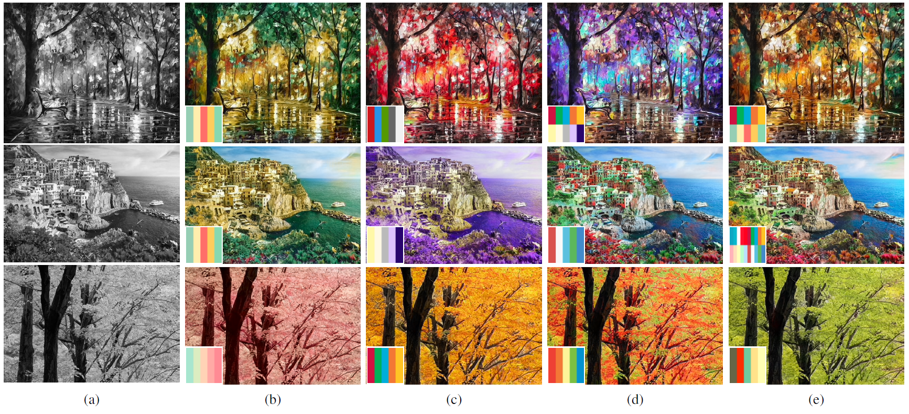

# Example-based Colorization via Dense Encoding pyramids



**Example-based Colorization via Dense Encoding pyramids**, Chufeng Xiao, Chu Han, Zhuming Zhang, Jing Qin, Tien-Tsin Wong, Guoqiang Han, Shengfeng He, _Computer Graphics Forum,_ 2019.

## Prerequisites

* Linux
* [Caffe](http://caffe.berkeleyvision.org/) & Pycaffe
* Python 2 or 3
* Python libraries (numpy, skimage, scipy)

## Getting Started

### Compile Caffe

* copy two files `softmax_cross_entropy_loss_layer.cpp`和`softmax_cross_entropy_loss_layer.cu` under the folder `./resources` into `<your caffe path>/caffe/src/caffe/layers/`

* copy the file `softmax_cross_entropy_loss_layer.hpp` under the folder `./resources` into `<your caffe path>/caffe/include/caffe/layers`

* Note that you also need to compile `pycaffe` and add it into  your `PYTHONPATH`:

  ```bash
  vi ~/.bashrc
  
  # add the two lines into the file
  PYTHONPATH=<you caffe path>/caffe/python:$PYTHONPATH
  LD_LIBRARY_PATH=<you caffe path>/caffe/build/lib:$LD_LIBRARY_PATH
  
  # save and update the environment
  source ~/.bashrc
  ```

* compile and test `caffe`:

  ```bash
  # execute under the root directory of caffe
  make clean # clean the files complied before
  
  make all -j8
  make test -j8
  ```

### Add Interface Files into Settings

In order to use the interface files for `caffe` layer, you need to add the path of the folder `./resources`

```bash
vi ~/.bashrc

# add this line
export PYTHONPATH=$PYTHONPATH:~/<DEPN path>/resources

# save and update the environment
source ~/.bashrc
```

### Download the Models of DEPN

There are two models you need to download for testing. `DEPN_init.caffemodel` saves the first-level parameters of DEPN, while `DEPN_sub.caffemodel` saves the parameters that can be shared by the second level and over.

```bash
wget https://drive.google.com/uc?id=1tE2FdfkvT2sJQu_VezVXqhgiNUY_yOZE&export=download -P ./models
wget https://drive.google.com/file/d/16x_Y2qSk_ewQlHlN0d1ESp1ahQcBiDY7/view?usp=sharing -P ./models
```

## Test and Generate Colorful Images

You can choose any image as a reference for the grayscale image, even a palette. Just simply execute `test.py` :

```bash
python test.py -gray <gray_dir> -refer <refer_dir> -output <output_dir>

# Example
python test.py -gray ./test_img/gray/1.jpg -refer ./test_img/refer/1.jpg -output ./test_img/result/1.png
```

Please make sure the size of the grayscale image is at least `64*64`. If you want to test the image with smaller size or want to adjust the first-level input size of DEPN, you should change the value of `init_level`in `test.py` into the size you desire. And then create a new file `DEPN_deploy_<size>.prototxt`:

* copy and paste the file `DEPN_deploy_64.prototxt` under the `./models/test/`

* change the name of the new file into `DEPN_deploy_<new_size>.prototxt`

* edit the file`DEPN_deploy_<new_size>.prototxt` and change the value `64` of the input layer into the new size:

  ```
  layer {
    name: "img_l"
    type: "Input"
    top: "img_l"
    input_param {
      shape { dim: 1 dim: 1 dim: 64 dim: 64 }
    }
  }
  
  layer {
    name: "ref_ab"
    type: "Input"
    top: "ref_ab"
    input_param {
      shape { dim: 1 dim: 2 dim: 64 dim: 64 }
    }
  }
  ```

The procedures of changing the input size of the second level and over are similar to these.